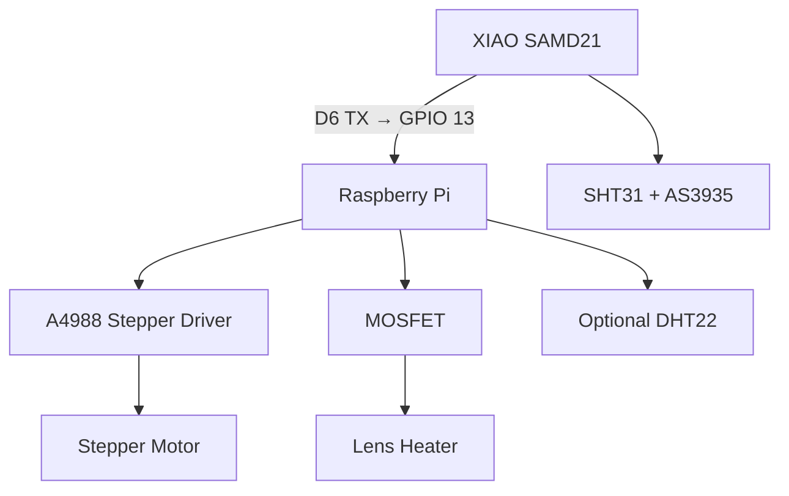

# 🔌 VIGILIS AllSky – Hardware & GPIO Guide

  <strong>Complete wiring reference for VIGILIS AllSky</strong> 
  Raspberry Pi, XIAO SAMD21, sensors, lens cover and heater

  
  
  
  

## ⚠️ Safety Information

- Raspberry Pi and XIAO SAMD21 GPIO pins use **3.3 V logic**
- Never apply 5 V or the motor/heater supply voltage to a GPIO pin
- Never power the stepper motor or heater directly from the Raspberry Pi
- Use an external power supply for the motor and heater
- Connect all grounds together
- Install a suitable fuse
- Disconnect all power before changing the wiring
- Never connect or disconnect the stepper motor while powered
- Set the stepper-driver current limit before operation

## 🧩 System Architecture

The XIAO SAMD21 reads the SHT31 and AS3935 sensors. It sends the processed sensor data to the Raspberry Pi through a one-way 3.3 V serial data connection.

## 📌 Raspberry Pi GPIO Assignment

GPIO numbers use the **BCM numbering scheme**.

| Component | Signal | BCM GPIO | Physical pin |
|---|---|---:|---:|
| A4988 | STEP | GPIO 17 | Pin 11 |
| A4988 | DIR | GPIO 27 | Pin 13 |
| A4988 | ENABLE | GPIO 22 | Pin 15 |
| Hall sensor | Cover open | GPIO 5 | Pin 29 |
| Hall sensor | Cover closed | GPIO 6 | Pin 31 |
| Heater MOSFET | Gate control | GPIO 24 | Pin 18 |
| Indoor DHT22 | Data | GPIO 4 | Pin 7 |
| Outdoor DHT22 | Data | GPIO 18 | Pin 12 |
| XIAO SAMD21 | Serial data input | GPIO 13 | Pin 33 |

> GPIO 13 is used by VIGILIS as a software serial input. Do not enable another function on this pin.

## 🔵 XIAO SAMD21 Assignment

| XIAO pin | Function | Connected device |
|---|---|---|
| 5V | Power input | Raspberry Pi 5 V |
| GND | Common ground | Raspberry Pi GND |
| 3V3 | Sensor power output | SHT31 and AS3935 VCC |
| D4 | I²C SDA | SHT31 SDA + AS3935 SDA |
| D5 | I²C SCL | SHT31 SCL + AS3935 SCL |
| D2 | Interrupt input | AS3935 IRQ |
| D6 / TX | Serial data output | Raspberry Pi GPIO 13 |

The XIAO SAMD21 is powered through its 3V3 pin using the regulated 3.3 V supply from the Raspberry Pi. Do not connect USB-C or 5 V power at the same time.

## 🔗 Raspberry Pi to XIAO SAMD21

| Raspberry Pi | XIAO SAMD21 |
|---|---|
| 3.3 V – Pin 1 or 17 | 3V3 |
| GND – for example Pin 6 | GND |
| GPIO 13 – Pin 33 | D6 / TX |

Only the XIAO TX line is required for one-way sensor communication. Do not connect two output pins together.

## 🌡️ Option A – DHT22 Directly on Raspberry Pi

VIGILIS supports DHT22 sensors connected directly to the Raspberry Pi.

### Indoor DHT22

| DHT22 pin | Raspberry Pi |
|---|---|
| VCC | 3.3 V |
| DATA | GPIO 4 – Pin 7 |
| GND | GND |

### Outdoor DHT22

| DHT22 pin | Raspberry Pi |
|---|---|
| VCC | 3.3 V |
| DATA | GPIO 18 – Pin 12 |
| GND | GND |

Install a **4.7–10 kΩ pull-up resistor** between `VCC` and `DATA` if it is not already fitted to the sensor module.

## 🌡️ Option B – SHT31 on XIAO SAMD21

| SHT31 pin | XIAO SAMD21 |
|---|---|
| VIN / VCC | 3V3 |
| GND | GND |
| SDA | D4 |
| SCL | D5 |

The normal SHT31 I²C address is `0x44`. Some modules can be configured to use `0x45`.

The SHT31 and AS3935 share the same I²C bus but use different addresses.

## ⚡ AS3935 Lightning Sensor on XIAO SAMD21

| AS3935 pin | XIAO SAMD21 |
|---|---|
| VCC | 3V3 |
| GND | GND |
| SDA | D4 |
| SCL | D5 |
| IRQ | D2 |

The AS3935 communicates through I²C. Its IRQ output informs the XIAO when lightning, noise or a disturber event is detected.

Keep the AS3935 away from the Raspberry Pi, switching power supplies, stepper driver, motor and heater cables to reduce electromagnetic interference.

## ⚙️ A4988 Stepper Driver

| A4988 pin | Connection |
|---|---|
| VDD | Raspberry Pi 3.3 V |
| Logic GND | Common GND |
| STEP | Raspberry Pi GPIO 17 |
| DIR | Raspberry Pi GPIO 27 |
| ENABLE | Raspberry Pi GPIO 22 |
| RESET | Connect to SLEEP |
| SLEEP | Connect to RESET and VDD |
| MS1 / MS2 / MS3 | Selected microstepping configuration |
| VMOT | External motor supply positive |
| Motor GND | External motor supply negative / common GND |
| 1A / 1B | Stepper motor coil A |
| 2A / 2B | Stepper motor coil B |

Install an electrolytic capacitor close to the driver’s `VMOT` and `GND` terminals.

A value of at least **47–100 µF**, with a voltage rating above the motor supply voltage, is recommended.

### Stepper Motor Coils

Identify the two motor coils with a multimeter:

- One coil connects to `1A` and `1B`
- The other coil connects to `2A` and `2B`
- Swap the two wires of one coil to reverse the motor direction

Do not rely on wire colours because they differ between manufacturers.

## 🧲 Hall Sensors

| Hall sensor | VCC | GND | Signal |
|---|---|---|---|
| Cover open | 3.3 V | Common GND | GPIO 5 |
| Cover closed | 3.3 V | Common GND | GPIO 6 |

The default VIGILIS configuration uses active-low Hall inputs with pull-ups enabled.

Only use sensor outputs that are safe for 3.3 V GPIO. Never feed a 5 V signal into the Raspberry Pi.

## 🔥 Heater and MOSFET

| Connection | Destination |
|---|---|
| Raspberry Pi GPIO 24 | MOSFET gate through a 100–220 Ω resistor |
| MOSFET gate | 10 kΩ pull-down resistor to GND |
| MOSFET source | Common GND |
| MOSFET drain | Heater negative |
| Heater positive | External power supply positive |
| External supply negative | Common GND |

Use a logic-level N-channel MOSFET whose `RDS(on)` is specified for a gate voltage of 2.5–3.3 V.

The MOSFET, wiring, connector and fuse must be rated for the heater current.

## ✅ Pre-Power Checklist

- [ ] GPIO numbering was checked in BCM mode
- [ ] Raspberry Pi and XIAO signals do not exceed 3.3 V
- [ ] All grounds are connected
- [ ] Motor coil pairs were identified
- [ ] A4988 current limit was adjusted
- [ ] VMOT capacitor was installed
- [ ] Heater polarity and MOSFET wiring were checked
- [ ] External power supply voltage and current rating are correct
- [ ] No exposed conductors can cause a short circuit
- [ ] Stepper motor is connected before power is applied

## 📚 References

- [Raspberry Pi documentation](https://www.raspberrypi.com/documentation/computers/raspberry-pi.html)
- [Seeed Studio XIAO SAMD21 documentation](https://wiki.seeedstudio.com/Seeeduino-XIAO/)
- [Sensirion SHT31 product information](https://sensirion.com/products/catalog/SHT31-DIS-F)
- [ScioSense AS3935 product information](https://www.sciosense.com/as3935-franklin-lightning-sensor-ic/)
- [Allegro A4988 product information](https://www.allegromicro.com/en/products/motor-drivers/brush-dc-motor-drivers/a4988)

## 📄 License

This documentation is licensed under the [MIT License](LICENSE).

Return to the [VIGILIS AllSky README](./README.md).
