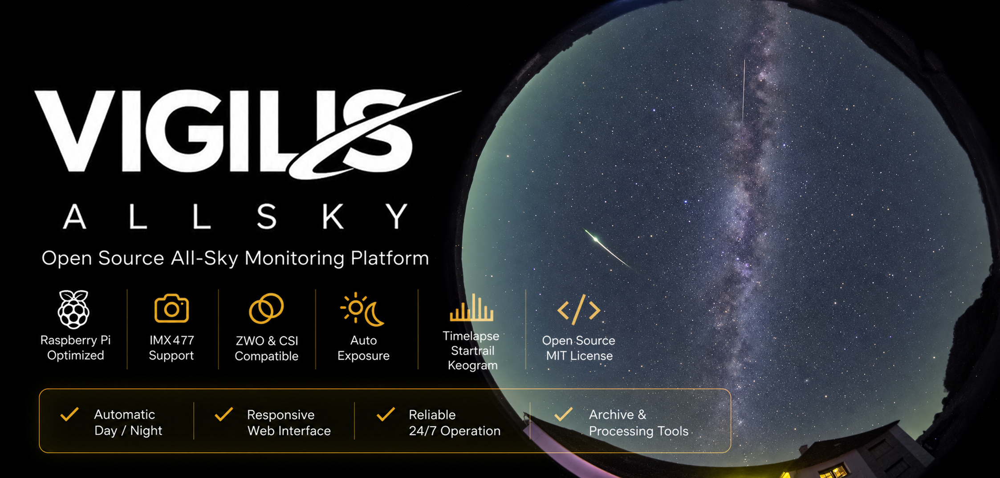
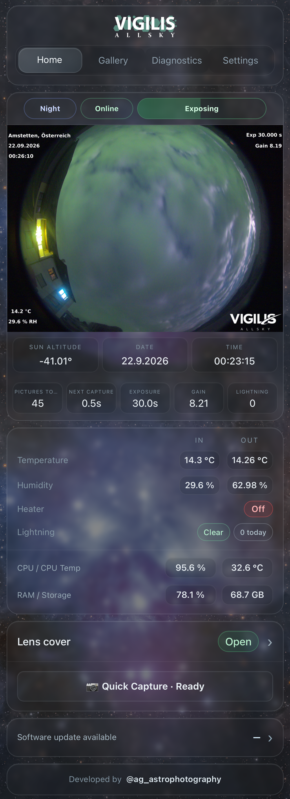
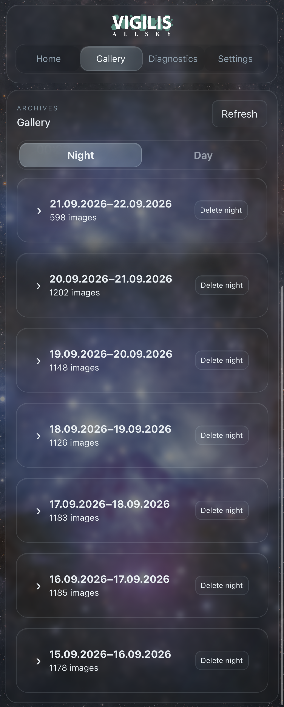
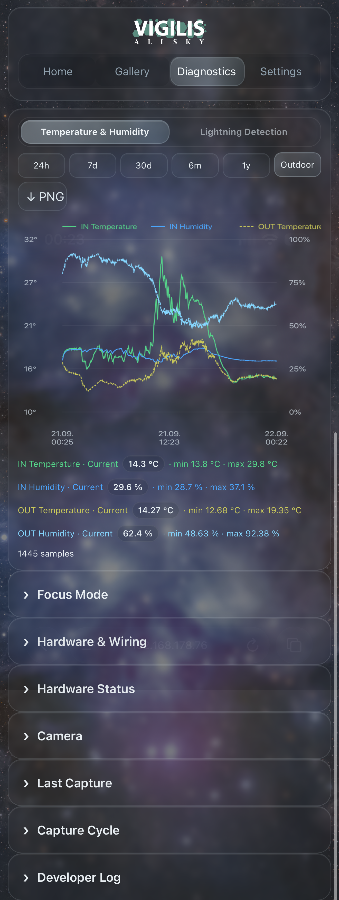
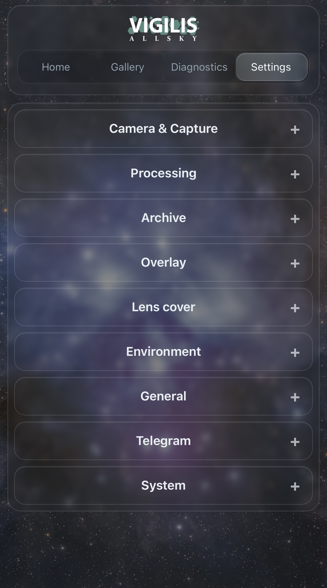

# VIGILIS AllSky

Open-source Raspberry Pi AllSky monitoring platform for automated sky imaging, environmental monitoring and night-sky processing.

> **Current release candidate:** VIGILIS AllSky 1.0.0-beta9.9  
> Download the latest beta from the [GitHub Releases page](https://github.com/1alex-yag/Vigilis-Allsky/releases).

---

## Overview

VIGILIS AllSky is a self-contained AllSky camera and monitoring platform designed for Raspberry Pi systems.

It combines automated image capture, adaptive exposure control, environmental monitoring, hardware automation and advanced night-sky processing in one responsive web interface.

Designed for continuous unattended operation, VIGILIS supports both Raspberry Pi CSI cameras and selected ZWO astronomy cameras.

---

## Highlights

- Raspberry Pi optimized
- CSI and ZWO camera support
- Automatic Day / Transition / Night operation
- Continuous automatic exposure and gain control
- Timelapse generation
- Keogram generation
- Clean and Full Startrails
- Hybrid Startrail Video
- Starogram
- Environmental monitoring
- Dew-point-based heater control
- Automatic lens cover
- Lightning detection support
- Telegram notifications
- OTA software updates
- Mobile-first responsive web interface

---

## Interface

VIGILIS is controlled completely through its responsive web interface.

### Home

Live station status, latest image, exposure progress, environmental values and hardware state.

### Gallery

Browse archived nights and days, generated products, timelapses, keograms, startrails and Starograms.

### Diagnostics

Environmental history, lightning activity, focus tools and hardware diagnostics.

### Settings

Camera, processing, archive, overlay, lens cover, sensors, heater, Telegram and system configuration.

---

## Night-Sky Processing

VIGILIS automatically creates several products (if selected) from each observing night.

### Timelapse

Creates a video from the captured AllSky frames.

### Keogram

Creates a time-based sky strip showing the evolution of the sky throughout the night.

### Clean Startrail

Generates a startrail image while rejecting problematic frames such as temporary glare or strong artificial light.

### Full Startrail

Creates a complete startrail using the available night frames.

### Hybrid Startrail Video

Combines accumulated startrails inside a configurable masking area with the current video frame outside the mask.

### Starogram

Combines a Hybrid Startrail Video with an animated Keogram and a static time axis.

---

## Advanced Processing

Advanced Processing provides additional control for difficult observing locations.

Features include:

- configurable sample points
- relative brightness-spike rejection
- masking circle
- hard or soft mask edges
- configurable blend width
- Keogram positioning editor

Source archive images are never modified by processing.

---

## Supported Hardware

### Raspberry Pi

VIGILIS is designed primarily for Raspberry Pi 4 systems.

### Cameras

Supported camera paths include:

- Raspberry Pi CSI cameras
- IMX477
- compatible libcamera sensors
- selected ZWO astronomy cameras

### Optional Hardware

VIGILIS can also integrate:

- SHT31 temperature / humidity sensors
- SAMD21 outdoor sensor node
- AS3935 lightning detector
- motorized lens cover
- heater / fan control
- external SSD storage

Optional hardware can be disabled when not installed.

---

## Installation

Download the newest package from:

**[GitHub Releases](https://github.com/1alex-yag/Vigilis-Allsky/releases)**

For the current beta release, use the Raspberry Pi package:

`VIGILIS-AllSky-1.0.0-beta9.9-RaspberryPi.zip`

The release archive contains the installer and all required VIGILIS application files.

---

## Updates

VIGILIS includes its own OTA update system.

The web interface can:

- check GitHub for new releases
- download the package
- verify the archive
- install the update
- restart VIGILIS
- perform a post-update health check

Beta and stable release channels are supported.

---

## Storage & Archive

Captured images and generated products can be stored on:

- Raspberry Pi storage
- external SSD / HDD

Archive retention and cleanup settings are available directly from the web interface.

---

## Environmental Monitoring

VIGILIS can record:

- indoor temperature
- indoor humidity
- outdoor temperature
- outdoor humidity
- heater state
- lightning activity

Diagnostics provides historical plots including a rolling 24-hour view.

---

## Open Source

VIGILIS AllSky is an open-source project released under the MIT License.

Contributions, testing and hardware reports are welcome.

---

## Current Status

**Latest release candidate:** `1.0.0-beta9.9`

This release is intended for final Raspberry Pi and overnight validation before V1.0.

Download:

**[VIGILIS AllSky Releases](https://github.com/1alex-yag/Vigilis-Allsky/releases)**

---

## Credits

Developed by **Alexander Gschöpf**

Astronomy / astrophotography:
`@ag_astrophotography`

---

## License

MIT License
